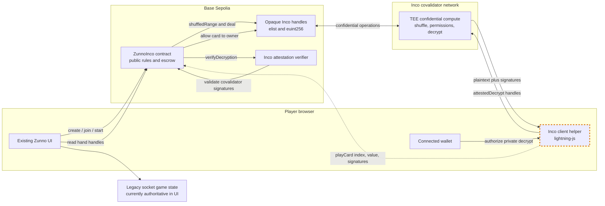
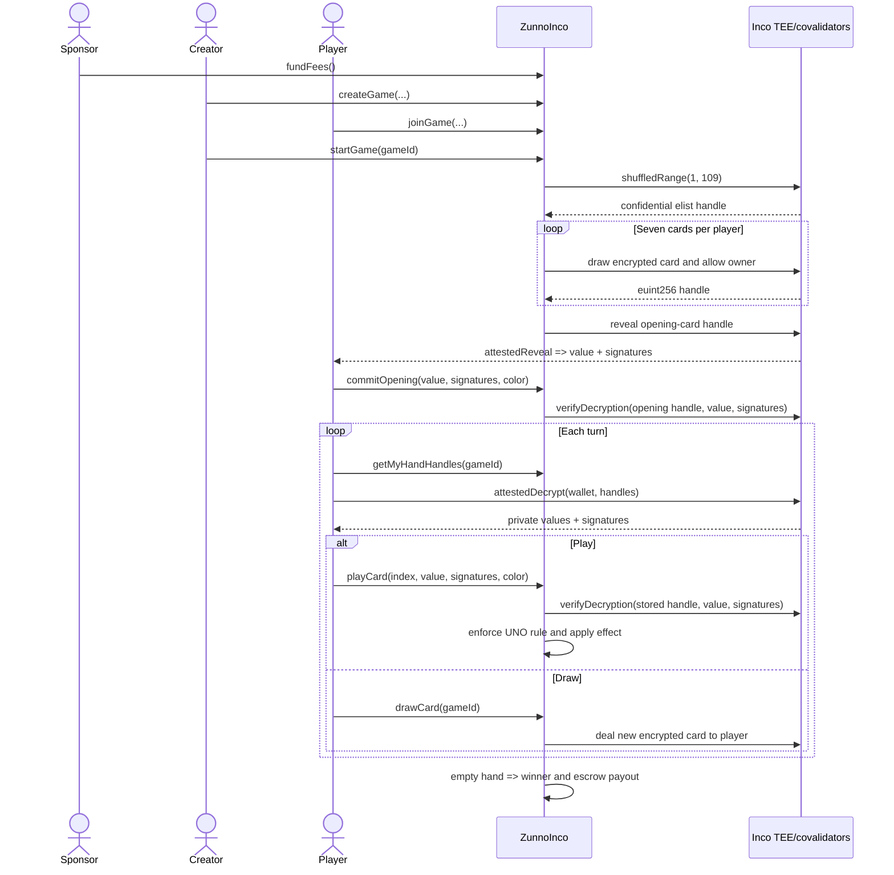

# How Zunno Uses Inco

Zunno uses **Inco Lightning 1.0.2** on Base Sepolia to keep the shuffled deck and each player's hand confidential while still letting the contract enforce UNO moves.

Inco Lightning is **TEE-based confidential computing**, not FHE and not a zero-knowledge proof system. Solidity stores opaque `bytes32` handles (`euint256` and `elist`); Inco covalidators process their confidential values and sign decryptions that the contract can verify.

Deployed contract: [`0x7eBD435491fE6F11109B4C3BE8AAFCC724ee7839`](https://sepolia.basescan.org/address/0x7eBD435491fE6F11109B4C3BE8AAFCC724ee7839)

## What is private?

| Data | Representation | Who is allowed? | When it becomes public |
|---|---|---|---|
| Shuffled deck order | Inco `elist` | Contract can use it; players cannot decrypt it | Only one dealt card at a time |
| Card in a player's hand | Inco `euint256` handle | Contract can use it; its owner can decrypt it | When the player submits it to `playCard` |
| Opening card | Inco `euint256`, then `e.reveal` | Everyone after the reveal is processed | Before `commitOpening` |
| Current top card and active color | Plain Solidity state | Everyone | Immediately after opening/play |
| Players, turn, pot, phase, winner | Plain Solidity state | Everyone | Always |

The card handle is not an encrypted number that Solidity can decode. It is a reference to confidential data managed by Inco. Permission to decrypt a handle is granted explicitly with `e.allow`.

## Architecture



The dashed SDK-to-contract arrow is the remaining integration boundary: the helper exists, but the active game UI does not call it yet.

## Confidential game lifecycle



## Where Inco appears in the code

### 1. Shuffle and fee

[`ConfidentialDeck._newShuffledDeck`](../contracts/src/kit/ConfidentialDeck.sol#L22) creates the values `1..108` and shuffles them as one confidential `elist`:

```solidity
deck = e.shuffledRange(1, n + 1, ETypes.Uint256);
e.allow(deck, address(this));
```

Range creation and shuffle consume Inco fees. [`deckFee`](../contracts/src/kit/ConfidentialDeck.sol#L18) calculates both operations, while [`fundFees`](../contracts/src/ZunnoInco.sol#L92) keeps shuffle funding separate from player escrow. `startGame` reverts if `feeBalance` is too low.

### 2. Private deal

[`_draw`](../contracts/src/kit/ConfidentialDeck.sol#L29) extracts the next confidential card handle and preserves contract access with `e.allowThis(card)`. [`_dealTo`](../contracts/src/kit/ConfidentialDeck.sol#L36) then grants only the receiving player permission:

```solidity
card = _draw();
e.allow(card, player);
```

[`ZunnoInco.startGame`](../contracts/src/ZunnoInco.sol#L207) stores seven such handles in each player's private hand mapping. The contract never writes their plaintext values to storage or events.

### 3. Player peeks at their hand

[`getMyHandHandles`](../contracts/src/ZunnoInco.sol#L340) returns only `hands[gameId][msg.sender]`. The browser passes those handles as an array to [`zap.attestedDecrypt`](../client/incoDeckClient.ts#L107):

```ts
const results = await zap.attestedDecrypt(walletClient, handles, options);
```

The wallet authorization identifies the player. Inco checks the handle permission and returns:

- the plaintext card value;
- the original handle;
- covalidator signatures over that decryption.

Another player is not allowed to decrypt those handles. The Foundry test verifies that each hand handle is allowed to its owner and the contract, but not the opponent.

### 4. Public opening card

[`_dealFaceUp`](../contracts/src/kit/ConfidentialDeck.sol#L46) calls `e.reveal(card)`. Public handles must be read with:

```ts
const [opening] = await zap.attestedReveal([openingHandle]);
```

Unlike private `attestedDecrypt`, `attestedReveal` needs no wallet signature. Once revealed, the value is public permanently. The returned signatures are submitted to [`commitOpening`](../contracts/src/ZunnoInco.sol#L235), which verifies them before moving the game from `Opening` to `Active`.

### 5. Playing without lying

The player already has the plaintext and signatures from peeking. They submit:

```text
playCard(gameId, handIndex, claimedValue, signatures, chosenColor)
```

[`playCard`](../contracts/src/ZunnoInco.sol#L265) loads the confidential handle at `handIndex` and calls:

```solidity
e.verifyDecryption(handle, claimedValue, signatures)
```

This binds the claimed value to that exact on-chain card handle. A player cannot claim that a red five is a wild card or submit another card's signatures. After verification, the normal Solidity codec checks whether the card matches the current color/value, applies action-card effects, removes the handle from the hand, and advances the turn.

Because removal uses swap-and-pop, the client must re-fetch hand handles after every successful play.

### 6. Draws and action cards

[`drawCard`](../contracts/src/ZunnoInco.sol#L251), Draw Two, and Wild Draw Four all call `_dealTo(player)`. New cards therefore remain confidential and are immediately decryptable only by their owner. Drawing ends the turn in the current contract rules.

### 7. Settlement

When a verified play empties the caller's on-chain hand, `_finish` records that caller as the winner and pays the escrow. Settlement therefore depends on verified Inco-backed card plays, not a winner supplied by the server.

## What Inco protects

- The server does not choose or learn the confidential deck order.
- Opponents cannot decrypt a player's allowed hand handles.
- A player cannot substitute a fake card value during `playCard`.
- Public card values are accepted only with covalidator signatures tied to the stored handle.
- Penalty draws use the same confidential deck instead of client randomness.

## What remains public or trusted

- Inco relies on its TEE/covalidator security model; this is not a zk proof.
- Player addresses, turns, action timing, card counts inferred from actions, top card, chosen color, pot, and winner are public.
- A compromised browser can leak its own player's decrypted hand.
- `ConfidentialDeck` currently owns one singleton deck, so `deckBusy` permits only one active confidential game at a time.
- Once a card value is submitted to `playCard`, it is public transaction data.

## Current integration status

| Layer | Status | Evidence |
|---|---|---|
| Inco Solidity dependency | Complete | `@inco/lightning` 1.0.2 |
| Confidential shuffle/deal/access control | Complete | `ConfidentialDeck.sol` |
| Attestation verification in opener/play | Complete | `_verifyValue` in `commitOpening` and `playCard` |
| Base Sepolia deployment and initial fee funding | Complete | deployed contract above |
| Private-hand client helper | Implemented, not connected | `client/incoDeckClient.ts` has no active UI import |
| Public opener helper | Missing | opener needs `attestedReveal`, not `attestedDecrypt` |
| Existing visual UI | Preserved | no layout/component redesign |
| End-to-end confidential UI game | **Not complete** | active `Game.js` still shuffles `PACK_OF_CARDS` locally and syncs it through sockets |

Today, pressing Start calls the deployed contract's `startGame`, so Inco really does shuffle and deal a confidential on-chain deck. The UI then initializes a separate legacy random deck and does not call `commitOpening`, `drawCard`, or `playCard`. Consequently, the deployed contract remains in `Opening` and is not yet the authoritative gameplay state.

Completing the integration does not require changing the visual design. It requires changing only the existing handlers/state source:

1. After `startGame`, read the opening handle with `attestedReveal` and call `commitOpening`.
2. Replace the locally shuffled player hand with `getMyHandHandles` + `peekMyHand`.
3. Route the Draw handler through `drawCard`, then re-fetch the hand.
4. Route the Play handler through `playCard` with the selected card's attested value/signatures.
5. Treat `getGameState` and contract events as authoritative; use sockets only to notify clients to refresh.
6. Remove the legacy `endGame` transaction path because the Inco contract settles automatically when the verified hand becomes empty.

## Tests

[`ZunnoInco.t.sol`](../contracts/test/ZunnoInco.t.sol) currently verifies:

- shuffle fees cannot silently consume escrow;
- each private card handle is allowed to its owner and the contract, not the opponent;
- the opening handle is publicly revealed;
- only the creator starts the game;
- legacy lobby entrypoints preserve `msg.sender` identity.

The missing acceptance check is one live Base Sepolia game that completes:

```text
create -> join -> start -> reveal opener -> commit opening
       -> private peek -> verified play/draw loop -> payout
```

## References

- [Inco Quickstart](https://docs.inco.org/quickstart)
- [Inco Confidential Deck template](https://github.com/Inco-fhevm/confidential-deck-template)
- [`ConfidentialDeck.sol`](../contracts/src/kit/ConfidentialDeck.sol)
- [`ZunnoInco.sol`](../contracts/src/ZunnoInco.sol)
- [`incoDeckClient.ts`](../client/incoDeckClient.ts)
